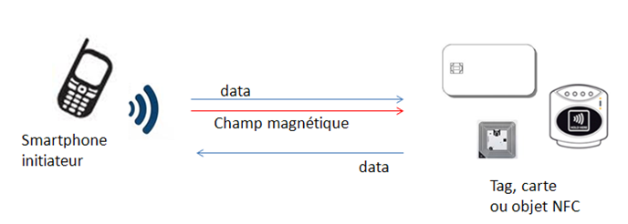

# Technologie RFID et NFC

La technologie RFID (Radio Frequency Identification) et NFC (Near Field Communication) sont des technologies
 similaires utilisées pour faire de la communication sans fil sur de courte portée en utilisant des ondes radio haute
 fréquence (13.56 MHz).
  - Utilisation d'une puce RFID en tant que puce d'identification (sous-cutanée)
  - Utilisation de tag NFC pour récuperer une image ou un plan
  - Paiement sans contact pour les téléphones ou cartes bancaires

Le NFC dispose de 3 vitesses de communication différentes :
  * 106 kbits/s
  * 212 kbits/s
  * 424 kbits/s
  
  Si on compare le RFID et le NFC aux autres technologies sans fil en fonction de la portée et de la distance,
  on obtient le diagramme suivant :
  

### Les 3 modes de fonctionnement entre deux dispositifs NFC

Le NFC dispose de trois modes de fonctionnement :

* Mode émulation de carte : le dispositif NFC se comporte comme une carte à puce et devient 
donc passif, cela nécéssite par contre une source d'énergie car les appareils utilisent généralement
 d'autre fonctionnalités (écran,applications, communication interne), contrairement à un tag NFC par exemple
 qui lui tire son énergie du champs émis par l'intérogateur.
 
 
* Le mode lecteur : l'appareil se compte comme un lecteur de carte sans contac. Il initie la 
communication en émettant un champ magnétique puis en envoyany une commande à la cible. La cible répond
 par rétro-modulation de l'onde incidente (envoyé par le lecteur)
  
 
* Mode Peer-to-Peer : Ce mode permet d'échanger des informations entre deux dispositifs NFC de mêmes niveaux 
de performance. Les appareils émettent des informations tours à tours. Ce mode de communication est plus lent 
du à l'utilisation d'un protocol plus lourd permettant de répartir les rôles entre les deux appareils NFC. 
C'est un mode qui peut servir à appairer des passerelles avec d'autres technologies (bluetooth par exemple).
 

### Fonctionnement d'un appareillage bluetooth

La technologie NFC permet donc par exemple d'appareiller simplement deux appareils. Le tag NFC contenue dans 
l'appareil bluetooth va transmettre son identifiant unique à l'appareil ce qui évite de le selectionner manuellement,
 ensuite les données d'authentification sécurisant la transmission, il n'est donc plus nécéssaire de saisir un code ni
 l'appareil a appairer.

### Application android
